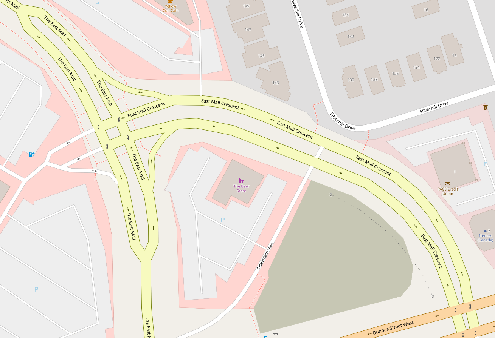

# street-desplitter

The goal of this project (not yet realized) is to un-split streets which are mapped as divided, for example:

This is an aspect of [cartographic generalization](https://en.wikipedia.org/wiki/Cartographic_generalization).
